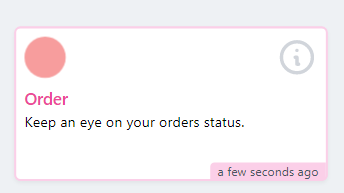
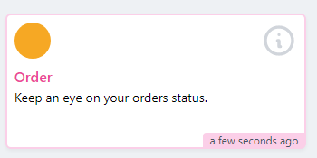
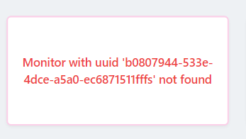

# Project Title

Laravel nova card

### Installation

composer require otrsw/nova-red-amber-green-card

## Config

    php artisan vendor:publish --provider="Otrsw\NovaRedAmberGreenCard\CardServiceProvider" --tag="config"

## Usage

        use Otrsw\NovaRedAmberGreenCard\NovaRedAmberGreenCard;

        //option 1 when all monitors have pulled from the same account then all you need is to publish the configand set the api key.
        return [
            (new NovaRedAmberGreenCard("bd1768eb-a9ee-4741-9659-dea5524c6c48"))->width('1/3'),
            (new NovaRedAmberGreenCard("b0807944-533e-4dce-a5a0-ec6871511fff"))->width('1/3'),
        ];

        //option 2 when monitors pulled fron diffrent accounts.
        return [
            (new NovaRedAmberGreenCard("bd1768eb-a9ee-4741-9659-dea5524c6c48"))->apiKey("api_key_1")->width('1/3'),
            (new NovaRedAmberGreenCard("b0807944-533e-4dce-a5a0-ec6871511fff"))->apiKey("api_key_2")->width('1/3'),
        ];

## screenshots

