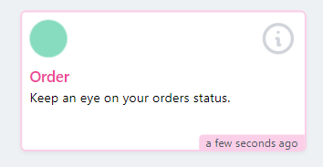

# Nova Red Amber Green Card

Laravel nova card to show the monitor details.

### Installation

composer require ontherocksoftware/nova-red-amber-green-card

## Config

    php artisan vendor:publish --provider="Ontherocksoftware\NovaRedAmberGreenCard\CardServiceProvider" --tag="config"

## Usage

        use Ontherocksoftware\NovaRedAmberGreenCard\NovaRedAmberGreenCard;

        //option 1 when all monitors under one account then all you need is to publish the config and set your api key.
        return [
            (new NovaRedAmberGreenCard("bd1768eb-a9ee-4741-9659-dea5524c6c48"))->width('1/3'),
            (new NovaRedAmberGreenCard("b0807944-533e-4dce-a5a0-ec6871511fff"))->width('1/3'),
        ];

        //option 2 when monitors using different accounts.
        return [
            (new NovaRedAmberGreenCard("bd1768eb-a9ee-4741-9659-dea5524c6c48"))->apiKey("api_key_1")->width('1/3'),
            (new NovaRedAmberGreenCard("b0807944-533e-4dce-a5a0-ec6871511fff"))->apiKey("api_key_2")->width('1/3'),
        ];

## screenshots

